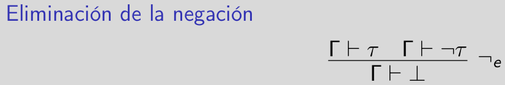

### <u>Deducción natural</u>

*Demostrar en deducción natural que las siguientes fórmulas son teoremas **sin usar principios de razonamiento clásicos** salvo que se indique lo contrario.*
#### Recordemos que una fórmula σ es un teorema si y sólo si vale $\vdash$ σ :*

*Nota: Las demostraciones se leen de abajo para arriba.*

---

### <u>*i.Modus ponens relativizado:*</u> (P ⇒ Q ⇒ R) ⇒ (P ⇒ Q) ⇒ P ⇒ R
---

$\frac{\Gamma \  \vdash \ (P ⇒ Q ⇒ R) \ \  (ax) \ \ \ \Gamma \ \vdash \ P \ \ (ax)}{\Gamma \ \vdash Q ⇒ R}{}⇒_e \frac{\Gamma \ \vdash \ P ⇒ Q \ \  (ax) \ \ \ \Gamma \ \vdash \ P \ \  (ax)}{\Gamma \ \vdash Q}⇒_e$
---

$\Gamma = (P ⇒ Q ⇒ R), \ (P ⇒ Q), \ P$\
Sabemos que P vale, entonces tenemos que: $\Gamma \vdash Q ⇒ R$,    $\Gamma \vdash Q$

$\frac{\Gamma \ \vdash Q ⇒ R\ \ \ \ \ \ \ \ \ \ \ \ \ \ \Gamma \ \vdash Q}{(P ⇒ Q ⇒ R),\ (P ⇒ Q), \ P \ \vdash R} ⇒_e$
---

Por: 

$\frac{(P ⇒ Q ⇒ R), \ (P ⇒ Q), \ P \ \vdash R}{(P ⇒ Q ⇒ R),\ (P ⇒ Q) \ \vdash P ⇒ R} ⇒_i$
---
$\frac{(P ⇒ Q ⇒ R), \ (P ⇒ Q) \ \vdash P ⇒ R}{(P ⇒ Q ⇒ R) \ \vdash (P ⇒ Q) ⇒ P ⇒ R} ⇒_i$
---
$\frac{(P ⇒ Q ⇒ R) \ \vdash (P ⇒ Q) ⇒ P ⇒ R}{\vdash (P ⇒ Q ⇒ R) ⇒ (P ⇒ Q) ⇒ P ⇒ R} ⇒_i$
---

---

### <u>*ii. Reducción al absurdo:*</u> (P ⇒ ⊥) ⇒ ¬P
---

Por eliminación de la implicación:

$\Gamma = (P ⇒ ⊥), P \ \ \ \sigma = ⊥ $

$\frac{(P ⇒ ⊥), P \ \vdash \ P ⇒ ⊥ \ \ \  (ax) \ \ \ \ \ \ (P ⇒ ⊥), P \ \vdash \ P \ \ \  (ax)}{(P ⇒ ⊥) , \ \ P \ \vdash \ ⊥}⇒_e$
---

$\Gamma = (P ⇒ ⊥) \ \ \ \tau = P $

$\frac{(P ⇒ ⊥) , \ \ P \ \vdash \ ⊥}{(P ⇒ ⊥) \ \vdash \ ¬P}¬_i$
---

$\frac{(P ⇒ ⊥) \ \vdash \ ¬P}{\vdash \ (P ⇒ ⊥) ⇒ ¬P}⇒_i $
---

---

### <u>*iii. Introducción de la doble negación:*</u> P ⇒ ¬¬P
---

Por la eliminación de la negación :

$\Gamma = P, \ ¬P \ \ \tau = P$

$\frac{P, \ ¬P \ \vdash P \ \ \  (ax) \ \ \ \ \ \  P, \ ¬P \ \vdash \ ¬P \ \ \  (ax)}{P \ , ¬P \ \vdash \ ⊥ }¬_e $
---

Por la introducción de la negación: $\Gamma = P, \tau = ¬P$

$\frac{P \ , ¬P \ \vdash \ ⊥}{P \ \vdash \ ¬¬P}¬_i $
---

$\frac{P \ \vdash \ ¬¬P}{\vdash P ⇒ ¬¬P}⇒_i $
---
---
### <u>*iv. Eliminación de la triple negación:*</u> ¬¬¬P ⇒ ¬P 
---

$\frac{¬¬¬P, \ P \ \vdash \ P \ \ \  (ax) \ \ \ \ \ \ ¬¬¬P,\ P \ \vdash \ P \ \ \  (ax)}{¬¬¬P, \ P \ \vdash \ ¬¬¬P \ \ \  (ax) \ \ \ \ \ \  ¬¬¬P, \ P \ \vdash \ ¬¬P \ }¬¬_i$
---

$\tau = ¬¬P$

$\frac{¬¬¬P, \ P \ \vdash \ ¬¬¬P \ \ \  (ax) \ \ \ \ \ \  ¬¬¬P, \ P \ \vdash \ ¬¬P \ }{¬¬¬P, \ P \ \vdash \ ⊥}¬_e$
---

$\frac{¬¬¬P, \ P \ \vdash \ ⊥}{¬¬¬P \ \vdash \ ¬P} ¬_i$
---

$\frac{¬¬¬P \ \vdash \ ¬P}{\vdash \  ¬¬¬P ⇒ ¬P} ⇒_i$
---
---

### <u>*v. Contraposición:*</u> (P ⇒ Q) ⇒ (¬Q ⇒ ¬P ) 
---

$\frac{}{} $

---
---

### <u>*vi. Adjunción:*</u> ((P ∧ Q) ⇒ R) ⇔ (P ⇒ Q ⇒ R) 
---

$\frac{}{} $

---
---

### <u>*vii. de Morgan (I):*</u> ¬(P ∨ Q) ⇔ (¬P ∧ ¬Q)
---

$\frac{}{} $

---
---

### <u>*viii. de Morgan (II):*</u> ¬(P ∧ Q) ⇔ (¬P ∨ ¬Q).
**Para la dirección ⇒ es necesario usar principios de razonamiento clásicos.**

---

$\frac{}{} $

---
---

### <u>*ix. Conmutatividad (∧):*</u> (P ∧ Q) ⇒ (Q ∧ P )

---

$\frac{}{} $

---
---

### <u>*x. Asociatividad (∧):*</u> ((P ∧ Q) ∧ R) ⇔ (P ∧ (Q ∧ R))

---

$\frac{}{} $

---
---

### <u>*xi. Conmutatividad(∨):*</u> (P ∨ Q) ⇒ (Q ∨ P )

---

$\frac{}{} $

---
---

### <u>*xii. Asociatividad (∨):*</u> ((P ∨ Q) ∨ R) ⇔ (P ∨ (Q ∨ R))

---

$\frac{}{} $

---
---

