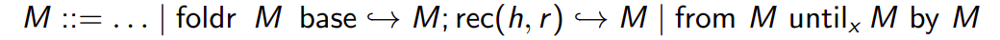
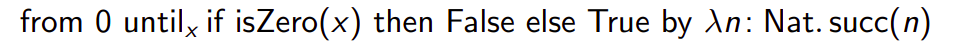
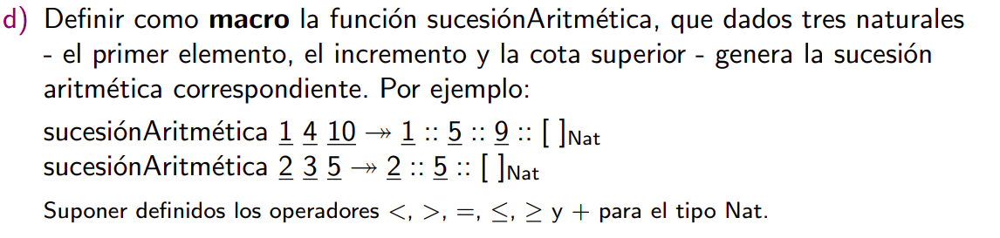

`foldr` juicio de tipado

```math
\frac{\Gamma \vdash M:[\rho] \hspace{1cm} \Gamma \vdash N:\tau \hspace{1cm} \Gamma U \{ h:\rho, r:\tau\} \vdash O:\tau}{\Gamma \vdash foldr\ M\ base \rightarrow N;\ rec(h, r) \rightarrow O \ : \tau} {}_{T-FOLDR}
```

```mathv
\frac{\Gamma \vdash M : \tau \hspace{1cm} \Gamma, x:\tau \vdash N:Bool \hspace{1cm} \Gamma \vdash O : \tau \rightarrow \tau }{\Gamma \vdash from\ M \ until_x \ N \ by \ O : [\tau]} {}_{T-FROM}
```

No se modifica el conjunto de valores porque no extendemos con un constructor de tipo.

Semántica

Congruencia: reducen los subtérminos

```math
\frac{M \rightarrow M'}{(foldr\ M\ base \rightarrow N;\ rec(h, r) \rightarrow O)  \rightarrow (foldr\ M'\ base \rightarrow N;\ rec(h, r) \rightarrow O)}
```

```math
\frac{M \rightarrow M'}{(from\ M \ until_x \ N \ by \ O) \rightarrow (from\ M' \ until_x \ N \ by \ O)} {}_{E-FROM1}
```

```math
\frac{M \rightarrow M'}{(from\ V \ until_x \ N \ by \ O) \rightarrow (from\ V \ until_x \ N \ by \ O')} {}_{E-FROM2}
```

Reducción:

```math
foldr\ []_\rho\ base \rightarrow N;\ rec(h, r) \rightarrow O \rightarrow N
```

```math
(foldr\ V_1::V_2\ base \rightarrow N;\ rec(h, r) \rightarrow O) \rightarrow (O\ \{h:=V_1, r:=foldr\ V_2 \ base \rightarrow N; rec(h, r) \rightarrow O\}
```

```math
\frac{\Gamma \vdash V_1 : \tau}{
(from\ V_1 \ until_x \ M \ by \ V_2) \rightarrow if\ M\{ x:= V_1 \}\ then \ []_\tau  \ else \ V_1::(from\ V_2\ V_1\ until_x \ M \ by \ V_2)
}
```



```math
{}_{E-FROM}, {}_{E-ISZERO-0} \rightarrow if(if \ isZero(0) \ then False \ else \ True )\ then \ []_{NAT} \ else \ 0::(from\ LAM\ 0\ until_x \ IF \ by \ LAM)
```

```math
{}_{E-IF} \rightarrow if (\ true \ then \ false \ else \ true)\ then ...
```

```math
{}_{E-IF-TRUE}, {}_{E-IF} \rightarrow if\ False \ then []_{Nat} else \ 0::from\ LAM\ 0\ until_x\ IF\ by\ LAM
```

```math
{}_{E-IF-FALSE} \rightarrow 0::from\ LAM\ 0\ until_x\ IF\ by\ LAM
```

```math
{}_{E-FROM_1}, {}_{E-LIST2}, \beta \rightarrow 0::from \ 1 \ until_x \ IF \ by \ LAM
```

```math
{}_{E-LIST2}, {}_{E-FROM} \rightarrow 0::if\ (if \ isZero(1) \ then \ False \ else \ True) \ then\ []_{Nat} \ else \ 1 :: from\ LAM\ 1\ until_x\ IF\ by\ LAM
```

```math
{}_{E-ISZERO-SUCC}, {}_{E-IFx2}, {}_{E-LIST2} \rightarrow |0::if\ (if\ False\ then\ False\ else\ True)\ then\ []_{Nat}\ else\ ...
```

```math
{}_{E-IF-TRUE}, {}_{E-LIST2} \rightarrow 0::[]_{Nat}
```



```math
sucesiónAritmética =_{def} \lambda p:Nat.\ \lambda c:Nat.\ from \ p\ until_x \ x\gt c\ by\ \lambda n:Nat.\ n+i