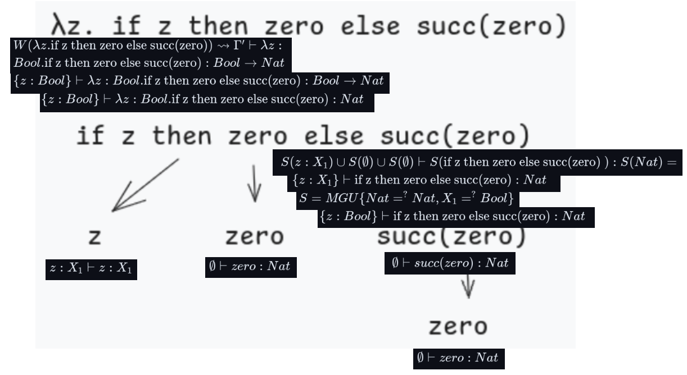
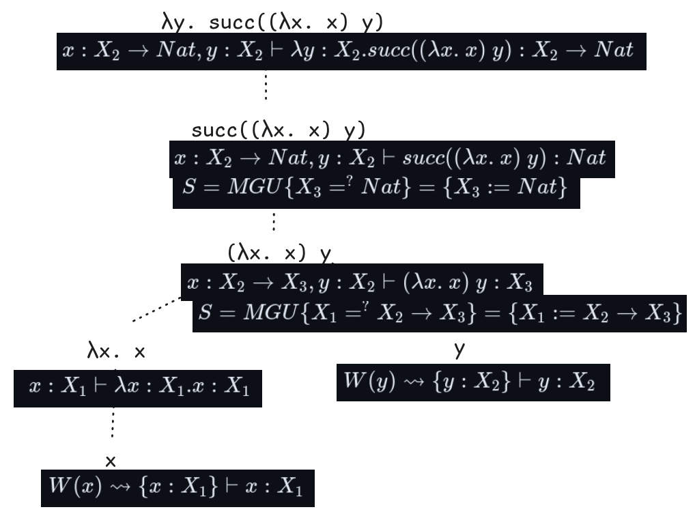

Decidir, utilizando el método del árbol, cuáles de las siguientes expresiones son tipables. 

Mostrar qué reglas y sustituciones se aplican en cada paso y justificar por qué no son tipables aquéllas que fallan.

## $i. \lambda \text{z. if z then zero else succ(zero)}$

Árbol:



$\color{pink}W(zero) \rightsquigarrow \empty \vdash zero:Nat$

$\color{red}\empty \vdash zero:Nat$

$\color{purple}W(z) \rightsquigarrow \{x : X_k\} \vdash x : X_k, \ \ X_k \text{incógnita fresca}$

$\color{red}z:X_1 \vdash z:X_1$

$\color{lime}W(succ(U)) \rightsquigarrow S(\Gamma) \vdash S(succ(M)) : Nat \text{, donde}$
* $\color{lime}W(U) = \Gamma \vdash M : \tau$
* $\color{lime}S = MGU\{\tau =^? Nat\}$

$S(\empty) \vdash S(succ(zero)):Nat$

$S=MGU\{Nat =^? Nat\} \rightsquigarrow \empty$

$\color{red}\empty \vdash succ(zero):Nat$

$\color{cyan}W(\text{if U then V else W)} \rightsquigarrow S(\Gamma_1) \cup S(\Gamma_2) \cup S(\Gamma_3) \vdash S(\text{if M then P else Q}) : S(\sigma) \text{, donde}$
* $\color{cyan}W(U) = \Gamma_1 \vdash M : \rho$
* $\color{cyan}W(V) = \Gamma_2 \vdash P : \sigma$
* $\color{cyan}W(W) = \Gamma_3 \vdash Q : \tau$
* $\color{cyan}S = MGU\{\sigma =^? \tau, \rho =^? Bool\} \cup {\sigma_1 =^? \sigma_2 | x : \sigma_1 \in \Gamma_i, x : \sigma_2 \in \Gamma_j , i, j \in \{1, 2, 3\}}$

$\text{if z then zero else succ(zero)}$

$S(z:X_1) \cup S(\empty) \cup S(\empty) \vdash S(\text{if z then zero else succ(zero) }) : S(Nat) = $

$\{z:X_1\} \vdash \text{if z then zero else succ(zero)} : Nat$

$S=MGU\{Nat =^? Nat, X_1 =^? Bool\}$

$S=MGU\{X_1 =^? Bool\}$

$S=\{X_1 := Bool\}$

$\color{red}\{z:Bool\} \vdash \text{if z then zero else succ(zero)} : Nat$

$\color{orange} W(\lambda x. U) \rightsquigarrow \Gamma' \vdash  \lambda x : \tau'.M : \tau' \rightarrow \rho \text{, donde}$

* $\color{orange}W(U) = \Gamma \vdash M : \rho$
*   ```math
    \color{orange}
    \tau' = \begin{cases} 
    \alpha & \text{si } x : \alpha \in \Gamma  \\
    X_k \text{con } X_k \text{variable fresca} & \text{en otro caso}
    \end{cases}
    ```
* $\color{orange}\Gamma' = \Gamma \ominus	\{x\}$

$\lambda z. \text{if z then zero else succ(zero)}$

$W(\lambda z. \text{if z then zero else succ(zero)}) \rightsquigarrow \Gamma' \vdash  \lambda z : Bool.\text{if z then zero else succ(zero)} : Bool \rightarrow Nat$

$\{z:Bool\} \vdash  \lambda z : Bool.\text{if z then zero else succ(zero)} : Bool \rightarrow Nat$

$\color{red}\{z:Bool\} \vdash  \lambda z : Bool.\text{if z then zero else succ(zero)} :  Nat$


## $ii. \lambda \text{y. succ((} \lambda \text{ x. x) y)}$

Árbol:




$\color{purple}W(z) \rightsquigarrow \{x : X_k\} \vdash x : X_k, \ \ X_k \text{incógnita fresca}$

$\color{red}W(x) \rightsquigarrow \{x : X_1\} \vdash x : X_1$

$\color{red}W(y) \rightsquigarrow \{y : X_2\} \vdash y : X_2$

$\color{orange} W(\lambda x. U) \rightsquigarrow \Gamma' \vdash  \lambda x : \tau'.M : \tau' \rightarrow \rho \text{, donde}$

* $\color{orange}W(U) = \Gamma \vdash M : \rho$
*   ```math
    \color{orange}
    \tau' = \begin{cases} 
    \alpha & \text{si } x : \alpha \in \Gamma  \\
    X_k \text{con } X_k \text{variable fresca} & \text{en otro caso}
    \end{cases}
    ```
* $\color{orange}\Gamma' = \Gamma \ominus	\{x\}$

$W(\lambda x. x) \rightsquigarrow x:X_1 \vdash \lambda x:X_1. x:X_1 \rightarrow X_1$

$\color{red}x:X_1 \vdash \lambda x:X_1. x:X_1$


$\color{violet}W(U V) \rightsquigarrow S(\Gamma_1) \cup S(\Gamma_2) \vdash S(M N) : S(X_k) \text{, donde}$

* $\color{violet}W(U) = \Gamma_1 \vdash M : \tau$
* $\color{violet}W(V) = \Gamma_2 \vdash N : \rho$
* $\color{violet}X_k \text{variable fresca}$
* $\color{violet}S = MGU\{\tau =^? \rho \rightarrow X_k\} \cup \{\sigma_1 =^? \sigma_2\ |\ x : \sigma_1 \in \Gamma_1, x : \sigma_2 \in \Gamma_2\}$

$\color{red}x:X_2 \rightarrow X_3, y:X_2 \vdash (\lambda x.\ x) \ y : X_3$

$\color{red}S=MGU\{X_1 =^? X_2 \rightarrow X_3\}=\{X_1:=X_2 \rightarrow X_3\}$

$\color{lime}W(succ(U)) \rightsquigarrow S(\Gamma) \vdash S(succ(M)) : Nat \text{, donde}$
* $\color{lime}W(U) = \Gamma \vdash M : \tau$
* $\color{lime}S = MGU\{\tau =^? Nat\}$

$\color{red}W(succ((\lambda x.\ x)\ y)) \rightsquigarrow x:X_2 \rightarrow Nat, y:X_2 \vdash succ((\lambda x.\ x)\ y):Nat$

$\color{red}S=MGU\{X_3 =^? Nat\} = \{X_3:=Nat\}$

$\color{orange} W(\lambda x. U) \rightsquigarrow \Gamma' \vdash  \lambda x : \tau'.M : \tau' \rightarrow \rho \text{, donde}$

* $\color{orange}W(U) = \Gamma \vdash M : \rho$
*   ```math
    \color{orange}
    \tau' = \begin{cases} 
    \alpha & \text{si } x : \alpha \in \Gamma  \\
    X_k \text{con } X_k \text{variable fresca} & \text{en otro caso}
    \end{cases}
    ```
* $\color{orange}\Gamma' = \Gamma \ominus	\{x\}$

$\color{red}W(\lambda y.\ succ((\lambda x.\ x)\ y)) \rightsquigarrow x:X_2 \rightarrow Nat, y:X_2 \vdash \lambda y:X_2. succ((\lambda x.\ x)\ y):X_2 \rightarrow Nat$


## $iii. \lambda \text{x. if isZero(x) then x else (if x then x else x)}$

## $iv. \lambda \text{x.} \lambda \text{y . if x then y else succ(zero)}$

## $v. \lambda \text{ if True then (} \lambda \text{ x. zero)zero else (} \lambda \text{ x.zero) False}$

## $vi. ( \lambda \text{f. if True then f zero else f False) (} \lambda \text{ x.  zero)}$

## $vii. \lambda x. \lambda y . \lambda z. \text{ if z then y else succ(x)}$