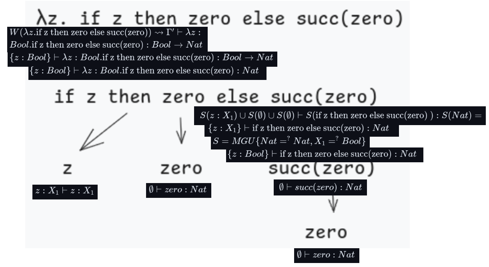
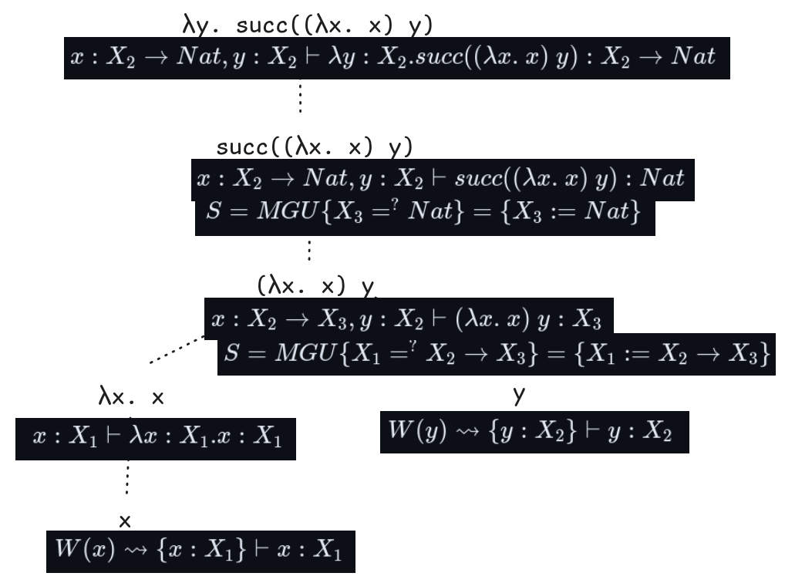

Decidir, utilizando el método del árbol, cuáles de las siguientes expresiones son tipables. 

Mostrar qué reglas y sustituciones se aplican en cada paso y justificar por qué no son tipables aquéllas que fallan.

## $i. \lambda \text{z. if z then zero else succ(zero)}$



$\empty \vdash zero:Nat$

$z:X_1 \vdash z:X_1$

$S(\empty) \vdash S(succ(zero)):Nat$

$S=MGU\{Nat =^? Nat\} \rightsquigarrow \empty$

$\empty \vdash succ(zero):Nat$


$\text{if z then zero else succ(zero)}$

$S(z:X_1) \cup S(\empty) \cup S(\empty) \vdash S(\text{if z then zero else succ(zero) }) : S(Nat) = $

$\{z:X_1\} \vdash \text{if z then zero else succ(zero)} : Nat$

$S=MGU\{Nat =^? Nat, X_1 =^? Bool\}$

$S=MGU\{X_1 =^? Bool\}$

$S=\{X_1 := Bool\}$

$\{z:Bool\} \vdash \text{if z then zero else succ(zero)} : Nat$


$\lambda z. \text{if z then zero else succ(zero)}$

$W(\lambda z. \text{if z then zero else succ(zero)}) \rightsquigarrow \Gamma' \vdash  \lambda z : Bool.\text{if z then zero else succ(zero)} : Bool \rightarrow Nat$

$\{z:Bool\} \vdash  \lambda z : Bool.\text{if z then zero else succ(zero)} : Bool \rightarrow Nat$

$\{z:Bool\} \vdash  \lambda z : Bool.\text{if z then zero else succ(zero)} :  Nat$


## $ii. \lambda \text{y. succ((} \lambda \text{ x. x) y)}$



$W(x) \rightsquigarrow \{x : X_1\} \vdash x : X_1$

$W(y) \rightsquigarrow \{y : X_2\} \vdash y : X_2$

$W(\lambda x. x) \rightsquigarrow x:X_1 \vdash \lambda x:X_1. x:X_1 \rightarrow X_1$

$x:X_1 \vdash \lambda x:X_1. x:X_1$

$x:X_2 \rightarrow X_3, y:X_2 \vdash (\lambda x.\ x) \ y : X_3$

$S=MGU\{X_1 =^? X_2 \rightarrow X_3\}=\{X_1:=X_2 \rightarrow X_3\}$

$W(succ((\lambda x.\ x)\ y)) \rightsquigarrow x:X_2 \rightarrow Nat, y:X_2 \vdash succ((\lambda x.\ x)\ y):Nat$

$S=MGU\{X_3 =^? Nat\} = \{X_3:=Nat\}$

$W(\lambda y.\ succ((\lambda x.\ x)\ y)) \rightsquigarrow x:X_2 \rightarrow Nat, y:X_2 \vdash \lambda y:X_2. succ((\lambda x.\ x)\ y):X_2 \rightarrow Nat$

## $iii. \lambda \text{x. if isZero(x) then x else (if x then x else x)}$


$W(x) \rightsquigarrow \{x : X_1\} \vdash x : X_1$

$W(x) \rightsquigarrow \{x : X_2\} \vdash x : X_2$

$W(x) \rightsquigarrow \{x : X_3\} \vdash x : X_3$

$W(x) \rightsquigarrow \{x : X_4\} \vdash x : X_4$

$W(x) \rightsquigarrow \{x : X_5\} \vdash x : X_5$

$W(isZero(x)) \rightsquigarrow \{x : Nat\} \vdash isZero(x):Bool$

$S=MGU\{X_1 =^? Nat\}=\{X_1:=Nat\}$

$W(\text{if x then x else x}) \rightsquigarrow \{x : Bool\}, \{x : X_5\} \vdash \text{if x then x else x}:X_5$

$S=MGU\{X_4 =^? X_5, X_3 =^? Bool\}=\{X_4:=X_5, X_3:=Bool\}$

$W(\text{if isZero(x) then x else (if x then x else x)}) \rightsquigarrow \{x:Nat\}, \{x:X_5\}, \{x : Bool\} \vdash \text{if isZero(x) then x else (if x then x else x)} :X_5$

$S=MGU\{X_2 =^? Bool, Nat =^? Bool\}={\color{yellow}\text{Falla}}$

## $iv. \lambda \text{x.} \lambda \text{y . if x then y else succ(zero)}$


$W(x) = x:X_1 \vdash x:X_1$

$W(y) = y:X_2 \vdash y:X_2$

$W(succ(zero)) = \empty \vdash succ(zero):Nat$

$W(\text{if x then y else succ(zero)}) = x:Bool, y:Nat \vdash \text{if x then y else succ(zero)}:Nat$

$S=MGU\{X_1 =^? Bool, X_2 =^? Nat\}=\{X_1:=Bool, X_2:=Nat\}$

$W(\lambda y . \text{if x then y else succ(zero)}) =$ 

$x:Bool \vdash \lambda y:Nat . \text{ if x then y else succ(zero)}:Nat \rightarrow Nat$

$W(\lambda x . \lambda y . \text{if x then y else succ(zero)}) =$

$\empty \vdash \lambda x:Bool . \lambda y:Nat . \text{if x then y else succ(zero)}:Bool \rightarrow Nat \rightarrow Nat$

## $v. \text{ if True then (} \lambda \text{ x. zero)zero else (} \lambda \text{ x.zero) False}$


$W(zero) = \empty \vdash zero : Nat$

$W(false) = \empty \vdash false : Bool$

$W(true) = \empty \vdash true : Bool$

$W(\lambda x.\ zero) = \empty \vdash \lambda x : X_1.\ zero : X_1 \rightarrow Nat$

$W(\lambda x.\ zero) = \empty \vdash \lambda x : X_2.\ zero : X_2 \rightarrow Nat$

$W((\lambda x.\ zero )\ zero) = \empty \vdash (\lambda x.\ zero )\ zero : X_3$

$S=MGU\{X_1 \to Nat =^? Nat \to X_3\}=\{X_1:=Nat\} = \{X_1:=Nat, X_3 :=Nat\}$

$W((\lambda x.\ zero )\ zero) = \empty \vdash (\lambda x.\ zero )\ zero : Nat$

$W((\lambda x.\ zero)\ false ) = \empty \vdash (\lambda x.\ zero)\ false : X_4$

$S=MGU\{X_2 \to Nat =^? Bool \to X_4\}=\{X_2:=Bool, X_4 := Nat\}$

$W((\lambda x.\ zero)\ false ) = \empty \vdash (\lambda x.\ zero)\ false : Nat$

$W(\text{if True then (} \lambda \text{ x. zero)zero else (} \lambda \text{ x.zero) False}) =$ 

$\empty \vdash \text{if True then (} \lambda \text{ x. zero)zero else (} \lambda \text{ x.zero) False} : Nat$


## $vi. ( \lambda \text{f. if True then f zero else f False) (} \lambda \text{ x.  zero)}$


$W(True)=\empty \vdash True : Bool$

$W(f) = f:X_1 \vdash f:X_1$

$W(zero)=\empty \vdash zero : Nat$

$W(f) = f:X_2 \vdash f:X_2$

$W(False)=\empty \vdash False : Bool$

$W(f\ zero) = f:X_1 \vdash f\ zero : X_3$

$S_1 = MGU\{X_1 =^? Nat \to X_3\}=\{X_1 := Nat \to X_3\}$

$W(f\ zero) = f:Nat \to X_3 \vdash f\ zero : X_3$

$W(f\ False) = f:X_2 \vdash f\ False : X_4$

$S_2 = MGU\{X_2 =^? Bool \to X_4\}=\{X_2 := Bool \to X_4\}$

$W(f\ False) = f:Bool \to X_4 \vdash f\ False : X_4$

$W(\text{if True then f zero else f False}) = $

$f:Nat\to X_3, f:Bool \to X_4 \vdash \text{if True then f zero else f False} : X_3$

```math
S=MGU\{X_3 =^? X_4, Bool ^? Bool\} \cup \{Nat \to X_3 =^? Bool \to X_4\}_{decompose} = \{Nat =^? Bool,  X_3 =^? X_4\}_{occurs-check} = Falla
```

## $vii. \lambda x. \lambda y . \lambda z. \text{ if z then y else succ(x)}$


$W(z) = z:X_1 \vdash z:X_1$

$W(y) = y:X_2 \vdash y:X_2$

$W(x) = x:X_3 \vdash x:X_3$

$W(succ(x)) = x:X_3 \vdash succ(x):Nat$

$S=MGU\{X_3 =^? Nat\} = \{X_3 := Nat\}$

$W(succ(x)) = x:Nat \vdash succ(x):Nat$

$W(\text{if z then y else succ(x)}) = z:X_1, y:X_2, x:Nat \vdash \text{if z then y else succ(x)}:X_2$

$S=MGU\{X_1 =^? Bool, X_2 =^? Nat\}=\{X_1 := Bool, X_2 := Nat\}$

$W(\text{if z then y else succ(x)}) =$

$z:Bool, y:Nat, x:Nat \vdash \text{if z then y else succ(x)}:Nat$

$W(\lambda z. \text{if z then y else succ(x)}) =$

$y:Nat, x:Nat \vdash \lambda z:Bool. \text{if z then y else succ(x)}:Bool \rightarrow Nat$

$W(\lambda y.\ \lambda z.\ \text{if z then y else succ(x)}) =$

$x:Nat \vdash \lambda y:Nat.\ \lambda z:Bool. \text{if z then y else succ(x)}:Nat \to Bool \rightarrow Nat$

$W(\lambda x.\ \lambda y.\ \lambda z.\ \text{if z then y else succ(x)}) =$

```math
\empty \vdash \lambda x:Nat.\ \lambda y:Nat.\ \lambda z:Bool. \text{if z then y else succ(x)}:Nat \to Nat \to Bool \to Nat
```